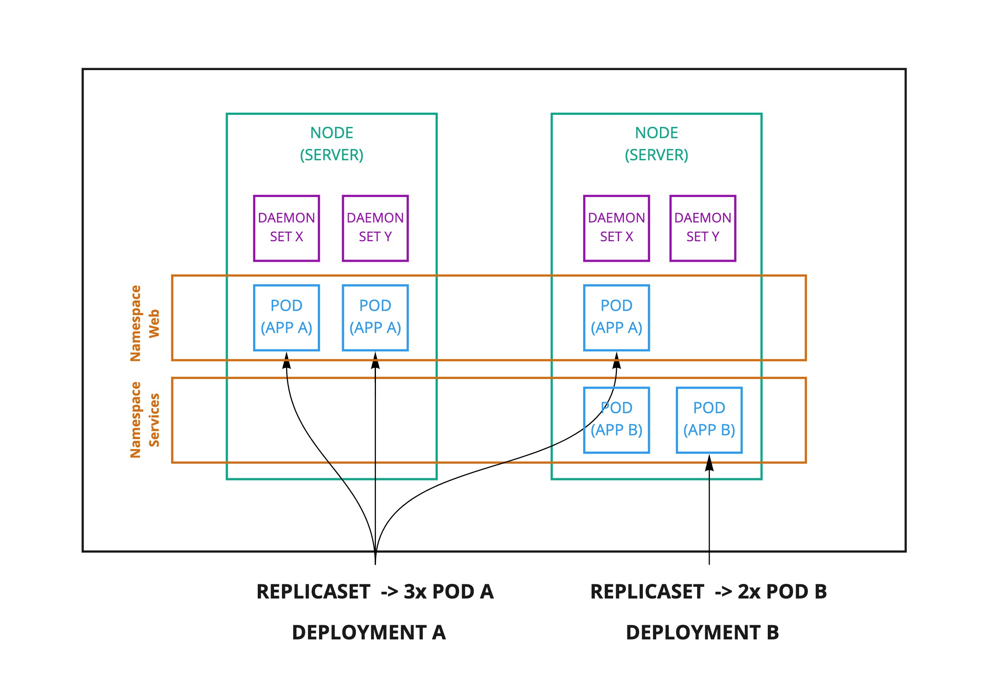

## datou-k8
---

#### Summary
This project will provide a primer to using kubernetes (k8). You will:

- deploy a local cluster using minikube
- learn about kubernetes primitives
- install common custom resources to enhance the capabilities of k8
- play with other supporting tools

#### Pre-requisites

| Application | Version <br/>(used this project) | Description | Command |
| -- | -- | -- | --|
| Minikube | v1.16.0 | local k8 cluster | `brew install minikube` |
| kubectl | v1.19.3 | cli to connect to k8 | `brew install kubectl` |

#### Managing the cluster
For this section, you will rely on the command line using `kubectl`. This CLI tool stores its configuration in `~/.kube/config` using contexts. You can think of contexts as different clusters that the CLI can point to.

| Command | Description |
| -- | -- |
| `minikube start` | Start the cluster |
| `minikube stop` | Stop the cluster |
| `kubectl config get-contexts` | Returns the contexts that you have configured. There will a `*` next to the context that you are currently using. |
| `kubectl config use-context <NAME>` | Switches to use the specificed context. In this project, it is `minikube` |

#### Basics - K8 primitives

This section will walk through api resources in K8 and what they do. Because the number of types of resources is so high, we will focus on the basic ones that most developers will need to know. You can run `kubectl api-resources` to see all of them.

Also, of note is that in Kubernetes resources can be managed through kubectl to call the main API Controller and behind the scenes it follows the same conventions. The main verbs we will focus on are `get` and `describe`.

#### Namespaces

The first concept we will introduce is namespaces. Namespaces in K8 are isolated from each other and don't know about each other except in very few instances (ie, k8 services). This is important to know because each resource we inspect below may need explicit namespace called out. 

``` 
    > kubectl get ns 

    NAME              STATUS   AGE
    default           Active   13d
    kube-node-lease   Active   13d
    kube-public       Active   13d
    kube-system       Active   13d    
```

#### Nodes

Nodes in K8 are the servers that everything is deployed on. In AWS terms, they would be the EC2 instances.

``` 
    > kubectl get nodes -o wide

    NAME       STATUS   ROLES                  AGE   VERSION   INTERNAL-IP    EXTERNAL-IP   OS-IMAGE             KERNEL-VERSION      CONTAINER-RUNTIME
    minikube   Ready    control-plane,master   13d   v1.20.0   192.168.49.2   <none>        Ubuntu 20.04.1 LTS   4.19.121-linuxkit   docker://20.10.0
```

#### Deployments

Next we go with deployments because it's the outer most (native) wrapper for an application that gets deployed to the cluster. 

```
    > kubectl get deployments -A

    NAMESPACE     NAME      READY   UP-TO-DATE   AVAILABLE   AGE
    kube-system   coredns   1/1     1            1           13d
```

If you run the describe command `kubectl describe deployments coredns -n kube-system`, you can review the contents to get a sense of what it's doing. Check it out and look at `Replicas`, `Pod Template` to prime yourself for the next primitive.

#### Replica Sets

ReplicaSets control and guarantee the number of desired pods.

```
    > kubectl get replicasets -A

    NAMESPACE     NAME                DESIRED   CURRENT   READY   AGE
    kube-system   coredns-74ff55c5b   1         1         1       13d
``` 

Again, you can describe this replicaset (but note the name will differ on your system) `k describe replicasets coredns-74ff55c5b -n kube-system`.

#### Pods

The pod wraps the application container and resides on nodes.

```
    > kubectl get pods -A

    NAMESPACE     NAME                               READY   STATUS    RESTARTS   AGE
    kube-system   coredns-74ff55c5b-4fs5j            1/1     Running   1          13d
    kube-system   etcd-minikube                      1/1     Running   1          13d
    kube-system   kube-apiserver-minikube            1/1     Running   1          13d
    ...
```

This resource definition will be the most interesting to inspect `kubectl describe pod coredns-74ff55c5b-4fs5j -n kubesystem` (the pod name will be different each time a pod is created)

| Field | Description |
| -- | -- |
| IP | The IP address of this pod. Other pods will use this IP during CoreDNS service discovery |
| Containers.coredns.Image ID | It's just docker! |
| Containers.coredns.Ports | The ports that this pod will be listening on |
| Containers.coredns.Limits | The hard upper limits of cpu/memory for this pod |
| Containers.coredns.Requests | The amount of cpu/memory that this pod would like so K8 knows which node to deploy (if available) |
| Containers.coredns.Liveness | Checks to see if a pod is alive or needs to be terminated and another pod to take its place |
| Containers.coredns.Readiness | Checks to see when this pod is ready to accept traffic |

#### Daemonsets

A daemonset is a pod that is deployed on every node. This is useful in instances where you have cluster wide functionality that you don't want to inject in every application pod you deploy.

```
    > kubectl get daemonsets -A

    NAMESPACE     NAME         DESIRED   CURRENT   READY   UP-TO-DATE   AVAILABLE   NODE SELECTOR            AGE
    kube-system   kube-proxy   1         1         1       1            1           kubernetes.io/os=linux   13d
```

In this example, K8 deploys kube-proxy on every node to manage the network rules (ie, routing tables, IP tables) to ensure nodes and pods can talk to each other.

#### Services

A service in k8 routes traffic to a destination. 

```
    > kubectl get svc

    NAME         TYPE        CLUSTER-IP   EXTERNAL-IP   PORT(S)   AGE
    kubernetes   ClusterIP   10.96.0.1    <none>        443/TCP   13d
```

#### ConfigMaps

A resource that allows you to store key-value pairs to inject environment variables to your pods. NOTE: you should not put sensitive information like passwords or api keys here. See the next section on Secrets.

```
    > kubectl get configmaps -A

    NAMESPACE         NAME                                 DATA   AGE
    default           kube-root-ca.crt                     1      13d
    kube-node-lease   kube-root-ca.crt                     1      13d
    kube-public       cluster-info                         1      13d
    kube-public       kube-root-ca.crt                     1      13d
    kube-system       coredns                              1      13d
    ...
```

#### Secrets

A resource to store sensitive data that can be injected into a pod through a volume.

```
    > kubectl get secrets -A

    NAMESPACE         NAME                                             TYPE                                  DATA   AGE
    default           default-token-xx29t                              kubernetes.io/service-account-token   3      13d
    kube-node-lease   default-token-xw4zx                              kubernetes.io/service-account-token   3      13d
    kube-public       default-token-v82bm                              kubernetes.io/service-account-token   3      13d
    kube-system       attachdetach-controller-token-254sp              kubernetes.io/service-account-token   3      13d
```

#### Exercise - First Deployment (1/4)

First we will deploy an application that echos our input. There is a deployment resource definition included in this project.

```
    > kubectl create deployment echoserver --image=k8s.gcr.io/echoserver:1.4 --port=8080
```

Here are some things you can try to test your knowledge:

1. How do you check on the health of the deployment?<details><summary>Answer</summary>`kubectl get deployment`</details>
1. How do you check the pods from this deployment? <details><summary>Answer</summary>`kubectl get pods`</details>
1. Scale up replicasets to 4 <details><summary>Answer</summary>`k scale --replicas=4 deployment echoserver`</details>

#### Exercise - Expose the Deployment VIA Service (2/4)

Now let's open the deployment so we can connect to it.

```
    > kubectl expose deployment echoserver --type=NodePort --name=echo-service --port=8080
```

Test your knowledge:

1. Check the minikube IP with `minikube ip`
1. Get the nodeport value from the service<details><summary>Answer</summary>`kubectl describe svc`</details>
1. Run a `curl <minikube_ip>:<nodeport>`

#### Exercise - SSH onto a node (3/4)

This technique is useful if you need to troubleshoot anything on the pod like network connectivity.

```
    > k exec -it echoserver-75d4885d54-6zt56 -- /bin/sh
```

#### Exercise - Cleanup (4/4)

```
    > kubectl delete service echo-service
    > kubectl delete deployment echoserver
```

#### APPENDIX: Tips & Tricks

| Name | Description |
| -- | -- |
| Alias your kubectl with `k` | If you are using zsh - add `kubectl` to your plugins<br/> Or add alias to your `~/.bash_profile` - `alias k='kubectl'` |
| Use the `-o wide` command to see more information | `k get po -A -o wide`<br/>`k get no -o wide` |
| You can use short hand | Check the api resources `k api-resources` and you will see abbrev. So you can things like `k get rs -A` to get replicasets |
| k9s | A vim style interface [alternative](https://github.com/derailed/k9s) |
| Lens | A GUI interface [alternative](https://k8slens.dev/) |

#### Upcoming Advanced Topics

- Using Helm
- Horizontal Pod Autoscaler
- Istio/Kiali
- Prometheus/Grafana
- Jaeger
- Argo (Project, App, GH/GHCR)
